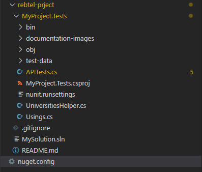
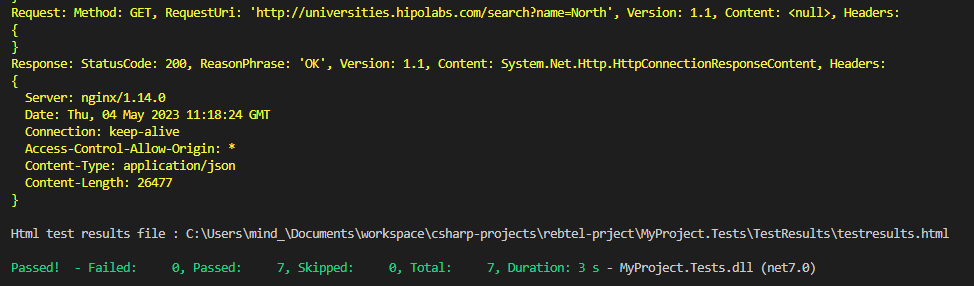
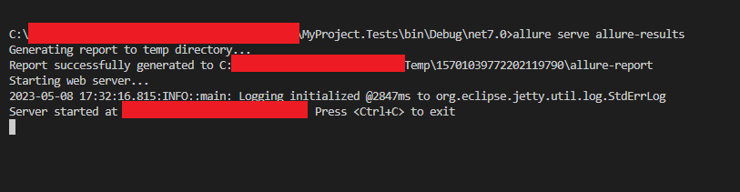
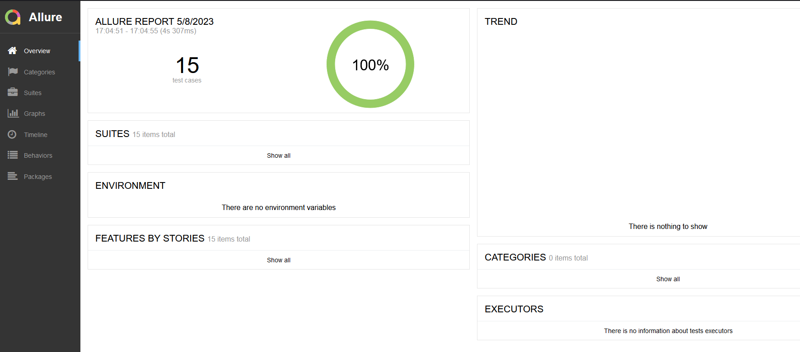
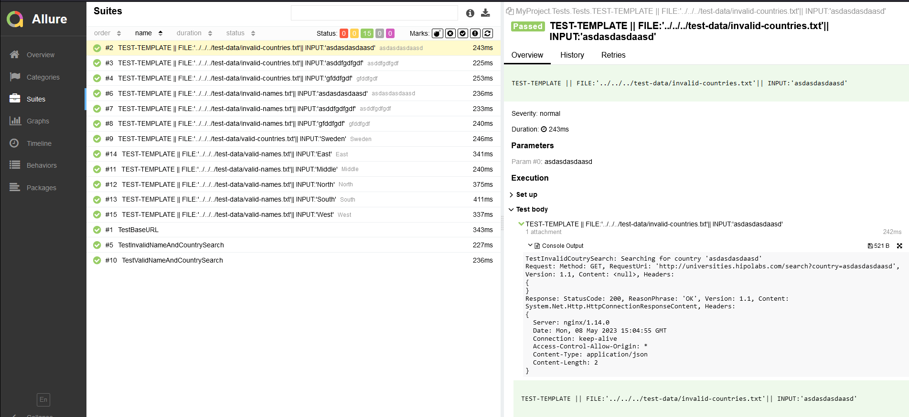
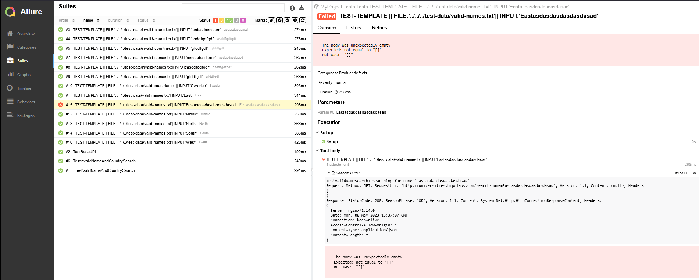

# Rebtel - test
This is a brief documentation of a test project that was created with C# (.NET 7) and NUnit for a simple public API for retrieving domains, names and countries of most of the universities of the world. The API can be accessed here: "http://universities.hipolabs.com" and you can access the documentation of the API here: https://github.com/Hipo/university-domains-list-api


## Setup
* Make sure you have .NET 7 installed.
* Make sure to have Java 8+ installed (for accessing the allure CLI): https://www.oracle.com/java/technologies/downloads/#jdk20-windows 
* Make sure to have allure CLI installed (for acessing the allure test reports): https://docs.qameta.io/allure/
* The project was created using Visual Studio Code in a Windows 10 enviroment.
* As a suggestion, for Visual Studio Code, a good addon/plugin to install is the C# plugin from microsoft.

## The structure of the project
Since the API was rather simple, the project is comprised of a help class called UniversitiesHelper.cs and the test suite called APITests.cs. Further, there is a folder with test data called test-data in which some .txt files were added to be used as input for the test methods. 




## How to run the project
Considering that you have .NET 7 installed on your computer, you just need to open a terminal and run the command:
 
```
dotnet test
```
While running, the tests will print information about the requests that were performed and the responses.



## Test reports
The project is configured to generate simple allure test reports. The test report files are generated under bin/Debug/net7.0/allure-results. In order to open the test report do the following steps:
* Make sure you are on a terminal on the folder ../MyProject.Tests/bin/Debug/net7.0/
* Issue the following command:

```
allure serve allure-results
```

The reports will be prompted on your browser automatically. And if not, the address to open on your browser will be shown on your terminal.



The report looks like this:



If you want more details of a specific test case, you can go into suites and select the test case of your choice:



Finally, as an example of a failing test, you will have enough information on how to reproduce the test through the endpoint that was invoked and parameters to the request:


